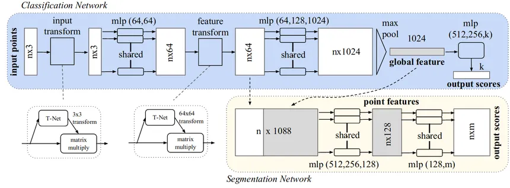

# PointNet: Deep Learning on 3D Point Clouds




---

## What is PointNet?

**PointNet** is a deep neural network architecture that directly consumes unordered point clouds and learns to perform tasks like classification and segmentation without converting point clouds into voxel grids or meshes.

It handles the **permutation invariance** of point cloud inputs and learns **global and local features** directly from raw 3D coordinates.

---

## Architecture Overview

The PointNet architecture can be broken down into 5 major stages:

---

### 1. Input Transformation Network (T-Net)

- Learns an affine transformation matrix to align the input points.
- Architecture: A small PointNet (MLP + Max Pooling + FC layers) that outputs a **3×3** matrix.
- Output: Aligned point cloud

---

### 2️. Shared MLP Layers

- Each point is passed through a **shared MLP** (Multi-Layer Perceptron).
- These layers are **applied independently** to every point using `1D convolutions (Conv1D)`.
- Typical dimensions:  
  `03 → 64 → 128 → 1024`
- Output: High-dimensional point features

---

### 3️. Global Feature Extraction (Max Pooling)

- Apply **max pooling** across all points to extract a **global feature vector** (size: 1024).
- This operation ensures **permutation invariance** across point orderings.

---

### 4️. Global MLP Head (Classification)

- The 1024-dimensional global feature vector is passed through a fully connected MLP:
  `1024 → 512 → 256 → k`  
  *(where `k` = number of classes)*

- Uses dropout and ReLU activations.
- Ends with **softmax** to produce class probabilities.

---

### 5️. (Optional) Feature Transformation Network

- A second T-Net that learns a **64×64** transformation matrix on the feature level.
- Acts as a regularizer to align learned feature spaces.

# PointNet 3D Shape Classifier


A simple implementation of PointNet to classify 3D objects from point cloud data. This project includes both training and deployment via a Streamlit web app.


## How to Run

### 1. Training the Model

#### Step-by-Step:
```bash
# Clone the repo and navigate to project
git clone https://github.com/GauravPatil8/Pointnet-unofficial_implementation.git
cd pointnet-project
```
```bash
# Create and activate a conda environment
conda create -n pointnet-env python=3.10 -y
conda activate pointnet-env
```
```bash
# Install dependencies
pip install -r requirements.txt
```
```bash
# Start training
python run.py
```


## 2. Model Interaction (Streamlit App)

### Option A: Using Docker (Recommended)

Build and run the Docker container:

```bash
# Build Docker image
docker build -t pointnet-app .
```
```bash
# Run the container
docker run -p 8501:8501 pointnet-app
```
---

## Citation

```bibtex
@article{qi2017pointnet,
  title={PointNet: Deep Learning on Point Sets for 3D Classification and Segmentation},
  author={Qi, Charles R and Su, Hao and Mo, Kaichun and Guibas, Leonidas J},
  journal={CVPR},
  year={2017}
}
